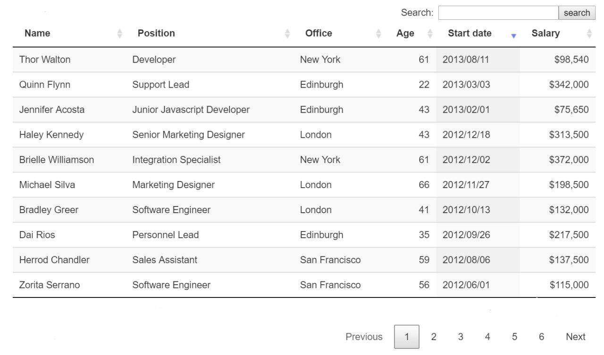

# Описание разработчика

Компонент сделал Александр Косицын.

## Основная идея компонента

Компонент "Таблица Людей".  
 При создании экземпляра компонента необходимо передать ему корневой элемент (в который рендерить таблицу) и
данные.  
 Основная идея:

1. У всего компонента есть состояние, которое хранится в экземпляре
2. В это состояние входит : значение инпута поиска(search), какой сортировщик выбран в таблице(в заголовке каждого столбца)
3. Выше указынные пункты генерируют фильтрованные данные(новый массив), которые потом рендарятся по 10 штук.
4. Кнопки пагинации рендерятся в зависимости от количества элементов в уже фильтрованном массиве
5. Плюс дополнительные фукнции, которые ,генерируют html, красят в зависимости от состояния элементы, сортируют и фильтруют исходный массив

# Описание

Отборочное тестовое задание на курсы стажировки разработчиков пользовательских интерфейсов в [«Инфосистемы Jet»](https://jet.su/)

# Установка

Склонируйте или загрузите репозиторий

```Shell
$ git clone https://github.com/anpt-jet/jet-trainess.git
```

Запустите `yarn` или `npm` с командой `start` для запуска dev-сервера

```Shell
yarn start
```

или

```Shell
npm run start
```

# Сборка

Запустите `yarn` или `npm` с командой `build` для сборки проекта (выходная директория `./build`)

```Shell
yarn build
```

или

```Shell
npm run build
```

---

## Задача

> Разработать модуль пользовательского интерфейса: **«Компонент Таблица»**

### Функциональные требования

* Сортировка: при нажатии по названию столбца происходит сортировка по этому столбцу, при повторном нажатии по названию столбца - сортировка в обратном порядке.
* Фильтрация: поле с кнопкой. При нажатии на кнопку происходит фильтрация данных по введенному значению.
* Пагинация.
* Модуль является независимым.
* Модуль имеет возможность переиспользования.

### Нефункциональные требования:

* Синтаксис `ES5+`.
* Чистый JS без использования сторонних библиотек.
* Чистый `CSS`.
* Данные для тестирования компонента необходимо реализовать самостоятельно в виде js-объекта или json

### Требования к дизайну

Модуль должен быть выполнен в соответствии с макетом.



> Допускаются отклонения от дизайна макета.

### Дополнительные требования

* Код не должен содержать синтаксических ошибок.
* Код должен быть форматирован в соответствии с правилами `ESLint`, `Stylelint`.

* Результат работы должен быть выложен на
  <a href="https://github.com">GitHub</a>
  /
  <a href="https://bitbucket.org">Bitbucket</a>.
